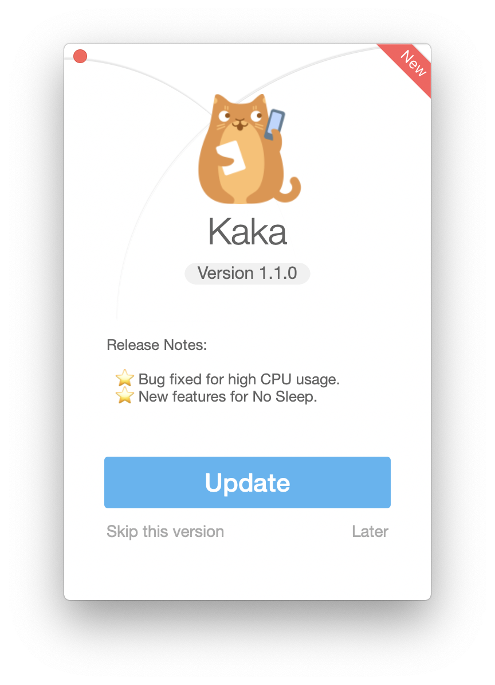

# AppStoreUpdateKit
[](https://github.com/HsiangHo/AppStoreUpdateKit)
[](https://github.com/HsiangHo/AppStoreUpdateKit/blob/master/LICENSE)
[](https://github.com/HsiangHo/AppStoreUpdateKit/issues)
[]()
[]()  
  
AppStoreUpdateKit is a easy way for developers to check updates from Mac App Store.  
[中文版](https://github.com/HsiangHo/AppStoreUpdateKit/blob/master/README_zh.md)  



## Installation
Clone the rep, build the AppStoreUpdateKit or copy all the source files into your project.
  
## Features
- [x] Customization and Configuration to your needs
- [x] Easy to check if the new version is available.
- [x] Awesome UI to request users to update to the new version or skip the current new version.

## Example

To run the example project, clone the repo, build and run the target 'AppStoreUpdateKitDemo'.

## Getting started  
- Check if the new version is available
```
#import <AppStoreUpdateKit/AppStoreUpdateKit.h>

//Create an app object with your app info. (the productID is important, find the productID on itunes website, eg: https://itunes.apple.com/us/app/kaka/id1434172933?mt=12)

    AppStoreUpdateAppObject *appObj = [[AppStoreUpdateAppObject alloc] initWithAppName:@"Kaka"
                                                                           withAppIcon:[NSImage imageNamed:@"cat"]
                                                                    withCurrentVersion:@"1.0.9"
                                                                         withProductID:@"1434172933"];
//Synchronize to check app update.
    //rslt will be YES if getting app info is successful.
    BOOL rslt =[[AppStoreUpdateManager sharedManager] checkAppUpdate:appObj];
    //Check if new version is available.
    rslt = [appObj isNewVersionAvailable]
    
//Asynchronize to check app update.
    [[AppStoreUpdateManager sharedManager] checkAppUpdateAsync:appObj withCompletionBlock:^(BOOL rslt, AppStoreUpdateAppObject * _Nonnull AppObj) {
        //rslt will be YES if getting app info is successful.
        
        //Check if new version is available.
        rslt = [AppObj isNewVersionAvailable]
        
        //Your code here
    }];

```

- Skip the current new version
```
...

//Check if the current new version has been skipped 
    [[AppStoreUpdateManager sharedManager] isCurrentNewVersionSkipped:appObj]
    
//Skip the current new version
    [[AppStoreUpdateManager sharedManager] skipCurrentNewVersion:AppObj];
      
```

- Request requestAppUpdateWindow and handle result

```
...
//This method MUST be invoked in the main thread!!
    [[AppStoreUpdateManager sharedManager] requestAppUpdateWindow:appObj withCompletionCallback:^(AppUpdateWindowResult rslt, AppStoreUpdateAppObject * _Nonnull AppObj) {
                    switch (rslt) {
                        case AppUpdateWindowResultUpdate:
                            [[NSWorkspace sharedWorkspace] openURL:[NSURL URLWithString:[NSString stringWithFormat:@"macappstore://itunes.apple.com/app/id%@",[AppObj productID]]]];
                            break;
                            
                        case AppUpdateWindowResultSkip:
                            [[AppStoreUpdateManager sharedManager] skipCurrentNewVersion:AppObj];
                            break;
                            
                        case AppUpdateWindowResultLater:
                            break;
                            
                        default:
                            break;
                    }
                }];

```

## Requirements
macOS 10.10 and above  
Xcode 8.0+

## Contributing
Contributions are very welcome 🙌 🤓
